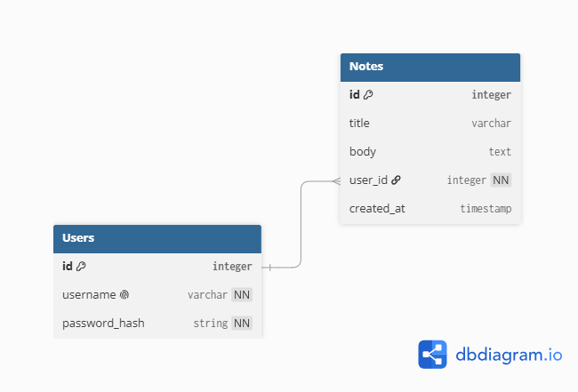

# Productivity Notes API
A simple Flask + SQLAlchemy REST API for user authentication and personal note-taking, secured with JWTs so each user can only see and manage their own notes.

## Schema



A `User` has a one-to-many relationship with `Note` — each note belongs to exactly one user, and a user can have many notes.

## Setup
```bash
pipenv install
pipenv shell
flask db upgrade
python seed.py
python app.py
```
The API runs at `http://localhost:5555`.

## Authentication
Most routes require a JSON Web Token. Sign up or log in to receive a token, then include it on subsequent requests:
```
Authorization: Bearer <token>
```

## Routes
| Method | Route         | Description                                             |
|--------|---------------|-----------------------------------------------------------|
| POST   | `/signup`     | Create a new user account and receive a token            |
| POST   | `/login`      | Log in with a username/password and receive a token       |
| GET    | `/me`         | Get the currently authenticated user *(token required)*   |
| GET    | `/notes`      | List the current user's notes, paginated *(token required)* |
| GET    | `/notes/<id>` | Get a single note owned by the current user *(token required)* |
| POST   | `/notes`      | Create a new note *(token required)*                      |
| PUT    | `/notes/<id>` | Replace a note's title/content *(token required)*          |
| PATCH  | `/notes/<id>` | Partially update a note *(token required)*                 |
| DELETE | `/notes/<id>` | Delete a note *(token required)*                           |

`GET /notes` accepts optional `page` and `per_page` query parameters (defaults: `page=1`, `per_page=5`).

## Tech Stack
- Flask
- Flask-RESTful
- Flask-SQLAlchemy
- Flask-JWT-Extended
- Flask-Bcrypt
- Marshmallow (validation/serialization)
- SQLite

## Contributing

Contributions are welcome. To get started:

1. Fork the repo and create a feature branch (`git checkout -b feature/your-feature`)
2. Make your changes and run the existing tests
3. Commit with a clear message and push your branch
4. Open a pull request describing what changed and why

Please keep model validations and Marshmallow schemas in sync when adding or changing fields.

## Author

**Robert Toroitich** ([RobertTRL](https://github.com/RobertTRL))
Full-Stack Software Engineer